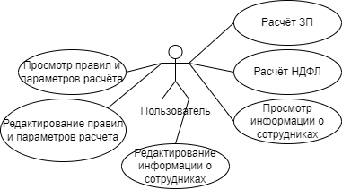

# SalaryCalculator
Контрольная работа по дисциплине "Введение в разработку ПО"

# Постановка задачи
Вариант №5. Простая программа расчета заработной платы. БД – для хранения правил начислений, удержаний, ставок налогов и других параметров расчета, а главное – для хранения работников и истории их зарплат (в т.ч. начислений и удержаний). Использовать более-менее реальную (хотя возможно упрощенную) формулу расчета НДФЛ, учитывающую доход с начала года, вычеты с начала года и уплаченный налог с начала года.

- Написать простую программу для расчёта заработной платы на языке программирования C#.
- Предусмотреть работу с базой данный. В ней будут храниться правила начисления и удержаний заработной платы, налоговые ставки, а также данные о сотрудниках, включая историю выплат заработных плат (начисления и удержания).
- Реализовать приближенный к реальному расчёт НДФЛ с учётом дохода, вычетов и уплаченных налогов с начала года.

# Анализ прецедентов
